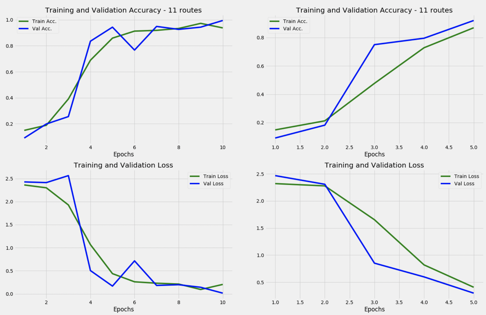

# Route-Reader

### Table of Contents
1. [Project Goal](#project_goal)
2. [The Data](#the_data)
3. [Exploratory Data Analysis](#eda)
4. [Pipeline](#pipeline)
5. [CNN Architecture](#cnn_arch)
6. [Results](#results)
7. [Future Work](#future_work)

## Project Goal 
Rock climbing has been growing in popularity in the past 5 years, particularly in Colorado and neighboring states.  Most climbers begin indoors in a rock climbing gym or at a local facility with an indoor climbing wall.  

  

As new climbers venture outside they are faced with the difficulties of navigating the various outdoor climbing areas (referred to as "crags").  A given crag can have 1 to 100+ separate climbing routes - each of which are composed of a line of bolts going up the wall.  These bolts are what the climber clips the rope into as he/she is climbing.  

  

Determining which route is which can prove very difficult for beginning outdoor climbers.  However, this problem is not unique to beginners - even experienced climbers often have difficulty locating particular climbing routes and occasionally even begin climbing something that is far more difficult than they intended.  Oftentimes routes look very similar to one another, and climbers can be overwhelmed by the volume of routes in a small area.

Take, for example, this route schematic from a popular crag in Clear Creek Canyon, Colorado, just west of Golden (image by Luke Childers). 

  

This crag contains over 30 separate climbing routes in less than 50 yards.  Several routes are within arms-reach of one another, and vary in difficulty from beginner-friendly to very advanced.

Here is another example from a crag located in the high desert of Southern Colorado (image by Reggie Slavens).

  

This crag has over 150 climbing routes located in less than a quarter-mile of walking distance - all the same height, on the same color rock, and on the same continous piece of rock.  The image below (from Matt Price) shows one of the routes from the "2150 Wall" from the ground.  Using the image below, can you identify what route is pictured?  Most likely not, and neither can a lot of climbers.

  

The current method of solving this problem is to use localized route guide-books or cell-phone apps to navigate outdoor crags.  Both have their disadvantages, most notably: guidebooks are expensive and can be limited in application.  For large areas like Shelf Road, a $40 guidebook is far from a be-all end-all solution.  Phone apps are crowd-sourced and therefore often unreliable.  The quality of information and images is questionable at best, and dangerous at worst.

This project investigates the potential of using a Convolutional Neural Network (CNN) to identify rock climbing routes outside.  Can an image of a climbing route taken from the ground looking upward at a route be used to identify the route by passing it into a trained CNN for that particular crag? 
 
 
 
 

## The Data 
The author took a total of 869 pictures of 11 different climbing routes at a climbing area located in Clear Creek Canyon, Colorado named "Anarchy Wall".  These pictures were manually sorted into respective directories before being passed through the image pipeline.  The original images were formatted as follows:
* 3024px x 4032px
* "portrait" orientation
* 6.6mb per image
* 1x optical zoom

Some route images were taken all at one time, and others were taken at two different times.  This was done to determine the effect of lighting conditions on CNN training and accuracy.

In order to optimize the accuracy of the identification process, each picture was taken from the same location - approximately 8ft from the base of the route, and **centered at the first bolt of the climb**.  Since it is impractical for an end-user to know precisely where the original images were taken, each training image was taken to create a reasonable level of location variance.  The camera was moved within an approximate range of 2ft x 2ft x 2ft (height x dist along wall x dist from wall).
 
 
 
 

## Exploratory Data Analysis 

  

Here is a visualization of the 11 different routes, resized to 250x250 that will be categorized by the CNN (bottom right is a duplicate of route 11).

  

 
 
 
 

## Pipeline 

Formatting images and directories comprised the bulk of early work.  Recall that the original images were taken on a cell phone, and as such are in a 9 x 12 aspect ratio.  Here is an example of an un-edited image as it is read in to Keras/Python/PIL:

  

This image is saved on file in the correct orientation.  Markdown, Python, PIL, and Keras all rotate images based on their widest dimension (they are always loaded in in "landscape" orientation).  CNN's perform optimally on square images.  Thus the Image Pipeline Class object for this project was created to fulfill the following objectives so that images could be "prepped" to be fed into the CNN for training and validation:

**Image Pipeline Purpose**
* Crop images to be square based upon their longest dimension (so that images of any aspect ratio or orientation can be passed in)
* Rename images to "route_name0001.jpg", "route_name0002.jpg", etc...
* Rotate images to be loaded into the Keras ImageDataGenerator object properly
* Augment the number of images to reach approximately 1000 images per training run
* Impart image randomization on the augmented images in order to simulate variation in input images
* Reshape the images (all further analysis has been done with 100x100 or 250x250 images)

Through use of the Data Pipeline Class Object, the original image shown above was cropped, rotate, renamed, and saved locally.  This process was repeated for every image in the parent directory.

  

Now the raw images had been prepped for input into the Keras ImageDataGenerator object.  The IDG takes images from a directory and imparts user-specified randomization to them.  It allows for training CNN's with unlimited number of images even if the source image count is small.  The first iteration of the Keras ImageDataGenerator object yielded the following examples (re-sized to 250px x 250px):

  

The images seen here were not cropped before-hand and therefore Keras adds black bars to the sides of the images when it is reshaped. After running images through the pipeline and tuning the randomization parameters (such as zoom, brightness variation, hor. and ver. shift, and rotation angle) the following example images are created:

  

 
 
 
 

## CNN Architecture 
Architecture was based upon research from past CNN's built on multi-class image identification problems, namely [this Kaggle example on identifying dog breeds](https://towardsdatascience.com/image-classification-python-keras-tutorial-kaggle-challenge-45a6332a58b8). The model summary is shown below.  Further discussion of architecture choice can be found in the next section.

|          Layer (type) | Output Shape   | Param # |
|----------------------:|----------------|---------|
|                Conv2D | (248, 248, 32) | 896     |
|          MaxPooling2D | (124, 124, 32) | 0       |
|              Conv2D 1 | (122, 122, 64) | 18496   |
|        MaxPooling2D 1 | (61, 61, 64)   | 0       |
|              Conv2D 2 | (59, 59 64)    | 36928   |
|        MaxPooling2D 2 | (29, 29, 64)   | 0       |
|              Conv2D 3 | (27, 27, 96)   | 55392   |
| MaxPooling2D 3        | (13, 13, 96)   | 0       |
| Conv2D 4              | (11, 11, 32)   | 27680   |
| MaxPooling2D 4        | (5, 5, 32)     | 0       |
| Dropout               | (5, 5, 32)     | 0       |
| Flatten               | (800)          | 0       |
| Dense                 | (128)          | 102528  |
| Dense 1               | (11)           | 1419    |
| Total Params:         | 243,339        |         |
| Trainable Params:     | 243,339        |         |
| Non-trainable params: | 0              |         |

 
 
 
 

## Results 

### Early Iterations ("proof of concept"):
The primary goal was simply to get a CNN trained.  11 Routes were simplified to 2 for the time being, and the model itself was run on very few samples and epochs.  The first successful run is shown below:

  

The first iterations had the sole purpose to ensure shape compatibility in the architecture.  As a result, the limited dataset and lack of optimization resulted in weak models such as the one seen below:

  

<b> </b> 2 Routes, 128images Tr, 64images Va, 32batch 

 

### Scaling to multi-class:

The CNN architecture was modified to begin categorizing multiple classes.  The final dense layer activation function and model loss function were updated accordingly.

| Type of Problem                       | Last-Layer Activation | Loss Function            |
|---------------------------------------|-----------------------|--------------------------|
| Binary Classification                 | sigmoid               | binary_crossentropy      |
| **Multiclass, single-label**             | **softmax**               | **categorical_crossentropy** |
| Multiclass, multilabel classification | sigmoid               | binary_crossentropy      |

<b>*Table: </b> Chollet, Deep Learning with Python p114 - Manning Publications* 

 

First model iterations yielded graphs like the one below.  The model began overfitting within only 2 to 3 epochs.  This overfitting was traced back to the implementation of batch normalization in the architecture, which was removed.  Removing batch normalization served to allow the model to train "slower" and prevent gross overfitting to the training set.

  

<b> </b> 3 Routes, 256images Tr, 128images Va, 32batch 

Removing batch normalization and modifying the number of training/validation images yielded promising results.

  

<b> </b> 3 Routes, 256images Tr, 128images Va, 32batch 

### Full-scale:
Moving from 3 routes to 11 proved much simpler than moving from 2 to 3.  A layer of dropout was added in order to prevent overfitting in early epochs, and validation accuracy levels of 95%+ were common.  One key aspect of the success is that the CNN architecture used in this application was optimized for use in a multi-class application (120+ classes).  As a result this model seemed to excel when exposed to many classes instead of 2 or 3.  

  

<b> </b> Left: 1024Tr, 256Va, 32batch    Right: 512Tr 256Va, 32batch 

 
 
 
 

## Future Work 
Many questions must be addressed in order to move forward in an efficient manner.  Optimization cannot be achieved from blind attempts at model or data manipulation. 

**Architecture Optimization**
- [ ] **How many layers? Nodes? Pooling Layers? Dropouts? Epochs?**
- [ ] Batch Normalization?
- [ ] Kernel Initializer at each layer?
- [ ] "Best" Optimizer ('rmsprop', 'adam', etc...)?

**Image Inputs/Randomization**
- [ ] Test on a true hold-out set
- [ ] Collect more images to test on truly un-seen images from totally different conditions
- [ ] Type of Randomization (brightness variance, zoom levels, axis shift, etc...)
- [ ] Add in a grayscale layer?
- [ ] Implement Batch Normalization?
- [ ] Best size? (currently running at only 100 x 100 x 3)

**Code Foundation**
- [ ] Add checkpoints to the model training
- [ ] Implement "optimal" architecture into the CNN class object
- [ ] Configure the model output to list the top 3 probabilities
- [ ] Implement ability to load prior model into the CNN class object
- [ ] Implement train_test_split into Pipeline class object

**Port to ECU and Train at Scale**
